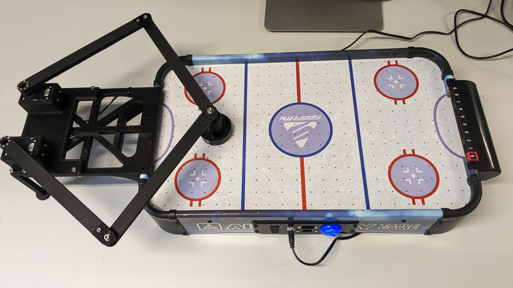

### Automated Air Hockey
This repository contains all code and designs required to build and use a remote controlled air hockey table. It has been developed at the NeuroComputing Sciences (NCS) lab at KTH Royal Institute of Technology.

### Control panel
The whole table is powered with a 12V supply through the 2.1mm barrel jack. For development purposes it is also possible to power the digital control board over USB.

The fan can be toggled on and off with the button.

### Communication
The table can be controlled over both USB and Ethernet.

Attached to the USB-port there is a CH340-chip. Using this on Windows might require installing a driver. The table will show up as a virtual comport and all the settings should match the defaults. The baudrate is 1MBaud.

When ethernet is connected the table hosts a TCP server on port 1337.

Both ethernet and USB use the same communication protocol.

### Protocol
The data protocol follows a simple id-data schema. The ID is a single uint8 and it is immediately followed by N data bytes.

For a reference implementation please see [this script](control_board_fw/test.py)

#### 2 - Handshake
1. ID: 2
1. Length: 0

The control board responds with a 1.

#### 3 - Control
- ID: 3
- Length: 12
- Format
  - [x_pos: float32]
  - [y_pos: float32]
  - [velocity: float32]

Sets the target position and velocity for the handle. The units are in centimeters and centimeters per second. The floats are encoded as standard IEEE.

To run at max velocity, set the velocity to 0.

The control board responds with a 1.

#### 4 - Read position
- ID: 4
- Length: 0

Reads the current handle position. The control boards responds with 2 float32, first the X position and then the Y position for a total of 8 bytes.

#### 5 - Toggle fan
- ID: 5
- Length: 1
- Format
  - [enabled: uint8]

Enables or disables the fan. Any value other than 0 is considered to be true.

The control board responds with a 1.